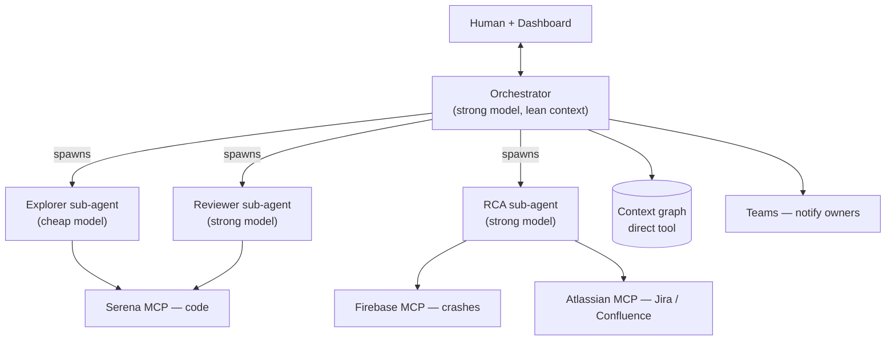
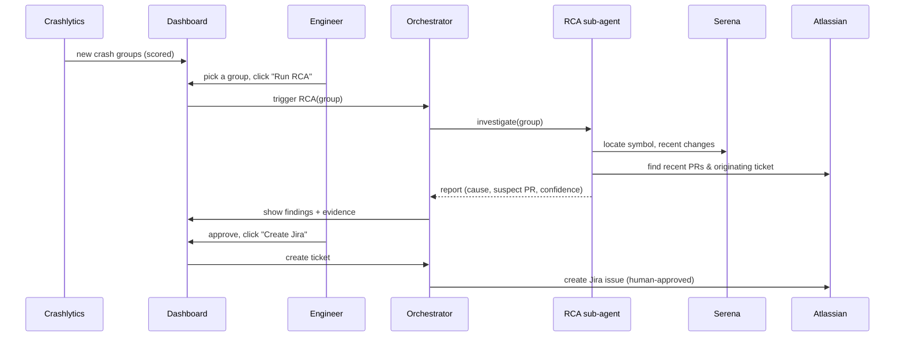

# Engineering Intelligence Platform
### Product & implementation document

| | |
|---|---|
| **Status** | Draft v0.1 — for review |
| **Scope (this phase)** | Frontend / mobile apps only |
| **Owner** | _[fill in]_ |
| **Last updated** | _[fill in]_ |
| **Audience** | Engineering teams (explainer) + platform implementers (spec) |

---

## 1. Overview

### The problem

Engineering knowledge is scattered across systems that don't talk to each other: requirements live in Confluence, work is tracked in Jira, code sits in the repo, crashes surface in Firebase Crashlytics, and releases happen in CI/CD. Because these are disconnected, requirements are never checked against the code that implements them, technical docs drift out of date, code reviews lack business context, and every production crash is investigated by hand from a cold start.

### What we are building

A platform that connects these systems and uses AI agents to reason across them — linking a requirement to the ticket that tracks it, the pull request that implements it, the release that shipped it, and the crash that followed. It maintains a shared **context graph** as long-term memory and runs specialised agents on top of it to review code, diagnose crashes, and keep documentation honest.

### What it is *not*

- **Not another code-review bot.** Existing tools inspect a diff in isolation. This system reviews a change against its requirement, its history, and prior incidents.
- **Not autonomous.** AI recommends, analyses, and drafts. Humans approve, merge, sign off requirements, and make production decisions. The system never writes to a system of record on its own.

### Why phased, and why frontend first

The defensible value is the graph and cross-lifecycle context, not any single agent. Building all of it at once proves nothing and risks a large bill before any value lands. We start with **frontend / mobile apps only** — a bounded set of repos and Crashlytics projects — and one flagship use case (crash root-cause analysis), then expand.

---

## 2. Core principles

**Context over intelligence.** The system's edge is knowing *why* code exists — which requirement introduced it, which ticket tracks it, which crashes touch it — not just what it does. Context is stored in the graph and reused, never rediscovered on every run.

**Human in control.** Every action that changes a system of record (creating a Jira ticket, publishing a Confluence page) is triggered or approved by a person through the dashboard. Agents surface and recommend; they do not commit.

**Owned vs. shared, not owned vs. third-party.** A capability is exposed over MCP (Model Context Protocol) when more than one agent or client will reuse it — this is true for third-party systems *and* for our own (code search, crash data). A capability used by exactly one consumer can be a direct in-process tool. The deciding question is reuse, not ownership.

**Cost-aware by design.** Token cost is a first-class concern, controlled through model tiering, context isolation, caching, per-run budget caps, and a cost view on the dashboard — not bolted on later.

---

## 3. System architecture

The platform is a layered system: a human-facing control plane on top, an orchestrator that plans and delegates, specialised sub-agents that do bounded work in isolated context, and a tool layer that exposes capabilities.



The mental model: **agents are brains, tools are hands.** An agent is an LLM loop that decides what to do; a tool is something it calls. MCP is one way to expose a tool — chosen when the tool is shared across multiple agents. This is why our own code, via Serena, sits in the tool layer over MCP: the Explorer, the Reviewer, and a developer's own coding assistant all reuse it.

---

## 4. Components — how each part works

### 4.1 Orchestrator

The orchestrator is the brain we build and own. It receives engineering events, decides what work is needed, spawns sub-agents to do it, synthesises their results, and owns the conversation with the dashboard and the human. It runs on a strong model and is kept deliberately context-lean: heavy exploration is pushed into sub-agents so the orchestrator's context stays small and cheap across turns.

**Implementation:** built on the Claude Agent SDK, which provides the agent loop, sub-agent spawning, MCP connections, skills, sessions, automatic context compaction, and a per-run cost cap (`max_budget_usd`). We do not hand-roll the loop.

### 4.2 Sub-agents

Sub-agents are child agent instances spawned for a bounded task. Each runs in its own **isolated context window** and returns only a compact summary to the orchestrator — ideal for work that sifts through a lot of material where most of it won't end up mattering. They cost more total tokens than a single flat agent (spawning N sub-agents roughly multiplies token use), so they are used deliberately, for the reasons below, not everywhere.

| Sub-agent | Job | Model tier | Tools it uses |
|---|---|---|---|
| **Explorer** | Gather code context for a PR or crash; locate symbols, references, dependencies, recent changes | Cheap | Serena (code) |
| **Reviewer** | Judge a change against its requirement, architecture, security, and tests; emit findings | Strong | Explorer output + Atlassian (requirements) |
| **RCA** | Diagnose a crash group: trace the stack to code, find recent suspect PRs and the originating ticket | Strong | Serena, Firebase, Atlassian |

**When to spawn a sub-agent:** the task is bounded, generates a lot of intermediate detail we don't want to keep, and returns something small. A one-shot lookup is a tool call, not a sub-agent. There is deliberately **no "talk to humans" sub-agent** — that is the orchestrator's job, and a separate agent for it would be pure overhead.

#### The Explorer → Reviewer handoff (context package)

The Explorer's whole purpose is to do expensive reading in throwaway context and hand back a small package, so the Reviewer never re-explores:

```json
{
  "target": "PR-123",
  "files_touched": ["PlaybackController.swift", "..."],
  "symbols": [{ "name": "MovieRepository.load", "file": "...", "role": "changed" }],
  "dependencies": ["downstream callers of load()"],
  "related_history": [
    { "type": "crash", "ref": "CRASH-001", "why_relevant": "same symbol, March incident" }
  ],
  "summary": "Concise architecture + impact summary in prose.",
  "unknowns": ["Could not resolve external dependency X via LSP"]
}
```

### 4.3 Skills

A skill is a versioned bundle of know-how — instructions, checklists, schemas, helper scripts — that an agent loads to do a task well (for example, an iOS code-review checklist, the RCA procedure, or the finding schema). Skills are separate from agents and from MCP: agents *load* skills and *call* tools.

Because skills are version-controlled files, they satisfy the governance requirement for prompt/procedure versioning for free — every finding can record which skill version produced it.

### 4.4 Context graph

The graph is the platform's long-term memory: typed, confidence-weighted relationships between entities (PRD, ticket, doc, PR, deployment, crash). It is the moat — the part no off-the-shelf tool provides — and also the hardest part, because the edges must be *constructed* and kept honest, not assumed.

Edges carry confidence and provenance, because many of them (especially `introduced_by`) are inferred, not facts:

```
(entity_a) --[relation, confidence, source, observed_at]--> (entity_b)

(CRASH-001) --[introduced_by, 0.88, rca-skill-v2, 2026-06-04]--> (PR-432)
(PR-432)    --[implements,    0.95, branch-convention,  2026-06-01]--> (JIRA-1123)
(JIRA-1123) --[originates_from, 0.70, prd-linker, 2026-05-20]--> (PRD-12)
```

**Implementation:** start simple — a typed-edge table with confidence and source columns — not a graph database on day one. Edge sources range from cheap and reliable (branch/commit conventions for PR→ticket) to inferred and probabilistic (RCA output for crash→PR). A reconciliation job handles staleness: reverted PRs, reassigned tickets, edited docs. A graph that silently goes stale is worse than none, because people trust it.

If only the orchestrator reads and writes the graph, it is a **direct tool**, not an MCP server.

### 4.5 Tool layer

| Tool | Exposes | Type | Notes |
|---|---|---|---|
| **Serena** | Symbol-level code search, references, structure (via LSP) | MCP (shared) | Returns semantic chunks, not whole files — major token saver. Needs a working LSP per language; SourceKit-LSP on the iOS repo is the first thing to validate. |
| **Firebase** | Crashlytics issues, stack traces, crash events, numerical reports | MCP (shared) | Official, in `firebase-tools`. One service account **per app's Firebase project** (`firebasecrashlytics.viewer`, least privilege). |
| **Atlassian (Rovo)** | Jira + Confluence read **and** write | MCP (shared) | Official, GA. OAuth 2.1, respects the signed-in user's permissions. One connector covers the PRD-read and doc/ticket-write loop. |
| **Teams** | Notify the owning team when something completes | Webhook / MCP | Needs an ownership map (below). Not yet connected. |
| **Context graph** | Entity and edge storage / queries | Direct tool | Single consumer (orchestrator) → no MCP overhead. |

### 4.6 Dashboard (control plane)

The dashboard is where humans see what the platform found and decide what to act on. It is the human-in-control gate: it ranks and recommends; the person triggers and approves. It surfaces the crash RCA queue, PRD gaps awaiting review, generated docs awaiting approval before publish, and the cost view.

The cost view shows tokens (cached vs. fresh — cache hit rate is the key efficiency number), cost per agent run and per event type, and the metric that actually matters: **cost per accepted finding**. It also exposes controls: per-agent and per-team budget caps, sampling rules, per-event-type toggles, and a kill switch.

### 4.7 Crash prioritization scoring

We never run RCA on raw crash events (Crashlytics produces thousands) — we score crash *groups* and let a human pull the trigger from the ranked queue.

```
Priority = users_affected × velocity × regression_weight × version_recency
```

| Factor | What it measures | Why it matters |
|---|---|---|
| **Regression weight** | Did this group first appear right after the latest release? | The single strongest signal — the cause is almost certainly in the diff just shipped, so the graph can point straight at suspect PRs. |
| **Velocity** | Rate of increase over 24–48h | Catches groups about to become incidents. |
| **Users affected** | Distinct users hitting it | Impact. |
| **Version recency** | How recent the affected build is | A six-month-stable crash is lower value than a fresh one even at higher volume. |

All inputs come from Crashlytics' numerical reports via the Firebase MCP.

### 4.8 PRD ingestion & document loop

The platform ingests requirements from Confluence, finds gaps (missing acceptance criteria, undefined edge cases, missing analytics/rollout/ownership), and surfaces them on the dashboard. From there a person can generate a technical-design draft and publish it back to Confluence.

**Critical control:** generated documents are **never auto-published**. The vision's own opening pain point is documents going stale — auto-publishing unreviewed AI drafts would make that worse. The draft and the detected gaps go to the dashboard; a human edits, approves, and only then is it written back via the Atlassian MCP.

**Ingestion scope (this phase):** only newly written / recently updated Confluence pages, detected via a CQL query on last-modified or a Confluence webhook. This is cheap, but it defers historical context (see §6).

### 4.9 Notifications & ownership map

When work completes (an RCA report is ready, a review is posted), the right team is notified via Teams. This depends on an **ownership map**: app/module → team → channel. The natural source is `CODEOWNERS` in each repo. Without it, "notify the right team" has nothing to resolve against.

### 4.10 Cost & control

Cost is managed by the levers below, all visible and adjustable on the dashboard:

- **Model tiering** — cheap model for the Explorer (grunt reading, triage); strong model only for Reviewer/RCA judgment and human-facing synthesis. This is the largest saving and the main reason for the sub-agent split.
- **Context isolation** — sub-agents quarantine expensive exploration so it's paid once, not re-sent every orchestrator turn.
- **Caching** — cache the stable parts (system prompts, coding standards, repo map). Verify how caching interacts with attached MCP servers in our setup, since this can vary.
- **Budget caps** — `max_budget_usd` per run, plus per-agent and per-team caps with a hard action (stop, or degrade to a cheaper model) on breach.
- **Group-not-event** — RCA operates on impact-gated crash groups, never raw events.

---

## 5. How it all works together

### 5.1 Crash → RCA → Jira (flagship)



The graph is updated along the way with the inferred `introduced_by` edge (with confidence), so the next related crash starts warm.

### 5.2 PR → code review

A PR-opened event triggers the orchestrator, which spawns the Explorer (builds the context package via Serena) and then the Reviewer (judges the change against its requirement and history, emits findings). Findings are posted as review comments — never as merge decisions. In phase 2 the Reviewer starts with requirement validation only, before expanding to architecture, security, and testing checks.

### 5.3 PRD → gaps → tech doc → Confluence

A new/updated PRD is ingested, analysed for gaps, and surfaced on the dashboard. A human reviews the gaps; the platform drafts a technical design; the human edits and approves; the approved doc is published back to Confluence and the owning team is notified via Teams.

---

## 6. Scope & key decisions

| Decision | Rationale | Tradeoff to accept |
|---|---|---|
| **Frontend / mobile apps first** | Bounded set of repos and Crashlytics projects; fastest path to a proven flagship | Backend services excluded for now |
| **Use Serena, don't build a code explorer** | Symbol-level exploration is a solved, token-efficient, open-source MCP; our value is orchestration + graph, not navigation | Must validate SourceKit-LSP on the large iOS repo early |
| **Build on the Claude Agent SDK** | Provides loop, sub-agents, MCP, skills, budget caps out of the box | Dependency on the SDK's runtime model |
| **Newest-only Confluence ingestion** | Cheap; sufficient for v1 | Defers the historical-context moat; plan a backfill of high-value spaces later |
| **Federated Crashlytics (one project per app)** | Matches how the apps are actually set up | Per-project service accounts + crash-schema normalisation before the graph |
| **Human-triggered writes only** | Upholds human-in-control; avoids the system acting as source of truth | Slightly slower than full automation, by design |

---

## 7. Evaluation

The platform must be measured continuously, but two traps have to be designed around:

- **Acceptance ≠ correctness.** A correct finding can be rejected as low-priority; an accepted one can be wrong. Track the two separately — never use acceptance as a proxy for quality.
- **No ground truth at launch.** Build an **offline eval harness**: a golden dataset of historical PRs and crashes with known answers, so a prompt/skill change can be regression-tested *before* it ships. This is what connects governance (versioning) to evaluation (does v2 actually beat v1).

| Metric | Target | Notes |
|---|---|---|
| Review precision | > 80% | Measured against the golden set, not live acceptance |
| False-positive rate | < 15% | |
| Developer acceptance | > 60% | Tracked separately from precision |
| RCA investigation time | −50% | Time-to-diagnosis vs. manual baseline |
| Cost per accepted finding | trend down | The real ROI metric |

---

## 8. Governance & auditability

Every agent prompt and skill is version-controlled (e.g. `review-skill-v1`, `review-skill-v2`). Every finding records its full provenance so it can be audited later:

```json
{
  "id": "finding-9f2",
  "type": "rca",
  "severity": "critical",
  "confidence": 0.88,
  "summary": "Likely nullability regression in MovieRepository.",
  "evidence": [{ "source": "serena", "ref": "MovieRepository.swift:L42", "detail": "..." }],
  "suggested_action": "Review PR-432 nullability change",
  "skill_version": "rca-skill-v2",
  "model": "claude-...",
  "created_at": "2026-06-04T..."
}
```

Developers mark findings correct / incorrect / helpful / not-helpful; this feedback feeds the golden set and tunes the skills.

Approval rules: informational findings need no action; warnings need developer review; critical findings need engineering-lead review.

---

## 9. Security & data handling

The platform itself ingests source code, requirements, and crash data into model context, so security is not only about what the Reviewer flags in others' code.

- **Prompt injection.** Tickets, PR descriptions, commit messages, and PRDs are human-authored text fed to agents that hold write access (Jira/Confluence). Treat all such text as untrusted input; never let it steer actions. Write actions stay human-approved, which is the primary mitigation.
- **Data residency.** Crash stack traces and logs can contain PII. Decide and document where this data goes (self-hosted vs. API, retention, no-training guarantees) before connecting regulated apps.
- **Least privilege.** Crashlytics service accounts are viewer-only unless write is required. Atlassian access runs under the signed-in user's existing permissions.
- **Graph access control.** The graph aggregates sensitive cross-team data; queries like "who owns this crash" are not for everyone.

---

## 10. Roadmap

| Phase | Goal | Exit criteria |
|---|---|---|
| **0 — De-risk** | Stand up Serena over the iOS repo | SourceKit-LSP indexes the repo cleanly; symbol queries work |
| **1 — Flagship** | Crash RCA on regression-flagged groups, dashboard + Jira creation | RCA reports accepted; time-to-diagnosis measurably down |
| **2 — Review** | Code review limited to requirement validation | Precision target met on the golden set |
| **3 — PRD loop** | PRD gap detection + reviewed doc publish | Teams adopt generated docs after human approval |
| **4 — Expand** | Confluence backfill, more apps, deployment intelligence | Cross-lifecycle traceability live across the frontend estate |

---

## 11. Open questions & risks

- Will SourceKit-LSP index the full iOS codebase reliably enough for production exploration?
- How accurate can inferred `introduced_by` edges be, and what confidence threshold is the human comfortable acting on?
- What is the right backpressure behaviour when crash volume spikes (queue, sample, defer)?
- Where does crash/log data legally need to live, and does that constrain the model deployment?
- Who owns this platform long-term? It is itself a product that needs a team — the same omission the PRD agent is designed to flag.

---

## 12. Glossary (for teams new to the terms)

| Term | Meaning |
|---|---|
| **Orchestrator** | The main agent that plans, delegates, and talks to humans. |
| **Sub-agent** | A child agent spawned for one bounded task, with its own context, that reports back a summary. |
| **Skill** | A versioned bundle of instructions/checklists an agent loads to do a task well. |
| **MCP** | Model Context Protocol — a standard interface for exposing a tool to agents. Used for capabilities reused by more than one agent. |
| **Context graph** | The platform's long-term memory: typed, confidence-weighted links between requirements, tickets, code, releases, and crashes. |
| **Finding** | A single AI-produced observation, with severity, confidence, evidence, and provenance. |
